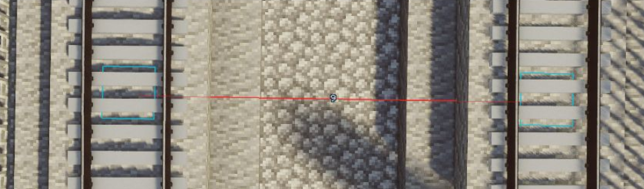

# 珲日青普速铁路建设标准文档

> [!tip]
> 更新日期：2025年10月13日

## 定义与术语解释

### 普速铁路

> 普速铁路线路是速度不超过120km/h，以动力集中式列车为主的铁路线路

### 区段站

> 解体与编组区段和沿零摘挂区段站的待编列车列车的车站，它是根据机车牵引区段的长度和路网的布局和规划设置的。 区段站的主要任务是改编区段到发的车流，为邻接的铁路区段供应机车，或更换机车及乘务员，为无改编中转列车办理规定的技术作业，办理一定数量的列车编解作业和客货运业务。

### 反向曲线

> 两个转向相反的圆曲线通过直线、缓和曲线或径相连接形成的平面线形结构

![[道路平面]道路平面线形设计与计算 - 土木在线](https://ts4.tc.mm.bing.net/th/id/OIP-C.Pb2CR4wNfm6RTavTaJV74wHaDw?rs=1&pid=ImgDetMain&o=7&rm=3)

## 建设要求

### 正线

#### 平面最小曲线半径

普速铁路最小曲线半径与限速的关系如表格显示所示

| 限速             | 半径（国标） | 半径（推荐） | 半径（困难） |
| ---------------- | ------------ | ------------ | ------------ |
| 40(仅限特别困难) | -            | 150          | 120          |
| 60               | 400          | 200          | 150          |
| 80               | 500          | 250          | 200          |
| 100              | 600          | 300          | 250          |
| 120              | 900          | 450          | 400          |

#### 区间正线线间距

如图所示，正线线间距应为两条轨道中心垂直连线，最低9格，极度困难7格

### 车站

#### 车站站坪

1. 站的站坪长度可采用不小于表格规定的数值。困难条件下，站坪长度可按实际需要确定。

| 车站种类      | 到发线有效长度 | 可接的固定编组列车       |
| ------------- | -------------- | ------------------------ |
| 中间站        | 360            | 非重连/重连(有效长度720) |
| 会让站/越行站 | 360            | 非重连/重连(有效长度720) |
| 乘降所        | 180            | -                        |

2. 车站出入站线路若为曲线，则必须为停车区间和曲线区间增设直线区间，防止车辆在出入站时与站台穿模

#### 车站正线

车站正线的平面设计标准应符合下列规定：

1. 区段站的正线应设计为直线。特殊困难条件下，如有充分依据，可设计为曲线，但其曲线半径不应小于下表规定的数值。

   |                              | 120km/h | 100km/h | 80km/h |
   | ---------------------------- | ------- | ------- | ------ |
   | 区段站                       | 300     | 300     | 300    |
   | 中间站 会让站 越行站         | 600     | 400     | 300    |
   | 中间站 会让站 越行站（困难） | 400     | 300     | 300    |

2. 车站的正线不应设计为反向曲线。纵列式区段站的正线设计为曲线时，每一运行方向的到发线有效长度范围内不应有反向曲线。

### 线路纵断面
线路纵断面是指在单位长度内，轨道的垂直高度变化的最大程度，用于评估铁路坡度。

普速铁路限制坡度不应大于表格规定的数值(‰)

| 120km/h | 100km/h | 80km\h |
| ------- | ------- | ------ |
| 12.0    | 24.0    | 30.0   |

部分参考值(120km/h)

| 抬升高度 | 所需线路长度 |
| -------- | ------------ |
| 1        | 84           |
| 2        | 167          |
| 3        | 250          |
| 4        | 334          |

### 道岔设计

1. 道路节点在接入多条铁路时，总接入铁路数量不得超过4条，单侧铁路接入数量不得超过2条。
2. 道岔最低水平半径不得低于60
3. 对于需要设计复试道岔的线路，线间距不得低于9
4. 对于限速大于40的高速道岔，水平半径按照[正线水平半径要求](/standard/standard?id=平面最小曲线半径)建设

### 其他

- 若有接触网，接触网的高度为7格高度，车辆受电弓高度也应为7格高度
  

参考资料：

[TB 10098-2017 铁路线路设计规范](https://www.doc88.com/p-0863886835599.html)

